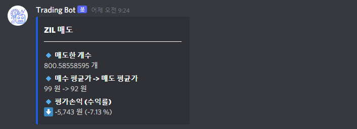
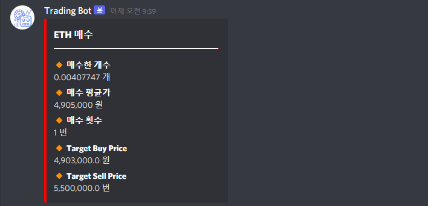
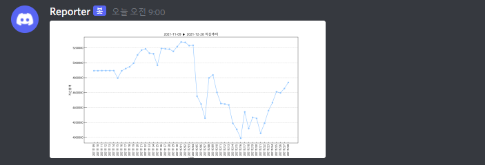

# 개발 중단
# SystemTradingBot

- Coin Trading With Upbit API ([링크](https://docs.upbit.com/))
- Stock Trading With CybosPlus ([링크](https://money2.daishin.com/E5/WTS/Customer/GuideTrading/DW_CybosPlus_Page.aspx?p=8812&v=8632&m=9508))

---
## Requirements
#### Coin Trading

- Enviroment: Linux, Windows
- python >= 3.7
- Upbit API 설정

#### Stock Trading

- Enviroment: Only Windows
- python >= 3.7   ==(주의! **_32bit_**)==
- 관리자 권한 실행
- CybosPlus 실행

## How to Start
1. `pip3 install -r requirements.txt`.
2. `config.ini.sample` 이름 변경 및 설정 -> `config.ini`
3. `python3 ${SYSTEM_TYPE} ${STRATEGY}`
   1. `SYSTEM_TYPE`: `coin`, `stock`
   2. `STARTEGY`: `FV`, `VB`, `CM`, `CMM`
   
> 예) `python3 tradingbot_starter.py coin FV`, `python3 tradingbot_starter.py stock CMM`
---
## Strategy

### 1. [FV] Flipping Volume Strategy -> 현재 불가능
> 이전 캔들의 거래량을 기반으로 현재 캔들에서 **거래량이 폭증했을 때 매수**하고 일정 시간 뒤에 매도하는 전략. (단타용)
>

**경고**: 단타를 위해 만들었으나 UPBIT API의 실시간 제공이 불안정하여 오탐률이 높음

### 2. [VB] Volatility Breakout Strategy -> 현재 불가능
> **현재 가격 >= 현재 캔들의 시가 + 이전 캔들의 변동성(고가 - 저가)의 일정 비율** 인 경우 매수하여, 다음 캔들에 매도하는 전략.
>

**주의**: 단타(30분 아래 분봉)의 경우, UPBIT API 제공에 따른 실시간 가격에 오차가 있을 수 있습니다. 최소 30분봉 Config를 추천합니다.

### 3. [CM] Catch Minimum Strategy -> 가능 😀

>   **현재 가격 <= 현재 캔들의 시가 + 이전 캔들의 변동성(고가 - 저가)의 일정 비율 X `N번`** 인 경우 매수하여 다음 캔들에 매도하는 전략. 즉, 저점에 매수하여 반등된 수익을 얻기위함

**주의**: 거래가가 하락했을 때 매수를 추가하기 때문에, 완전한 하락세에는 매우 높은 손해를 볼 수 있습니다.

### 4. [CMM] Catch Min Max Strategy -> 현재 불가능

---

## Discord Webhook 연결

디스코드 웹훅을 연결하면 아래와 같이 알람을 받을 수 있습니다.

1. Trading Log

   

   > 봇 시작시 기본 정보 표시

   

   > 매도시 해당 종목에 대한 매도 정보 및 손익 표시

   

   > 매수시 해당 종목에 대한 매수 정보 및 목표추가매수가, 목표추가매도가 표시(CMM에서만)

2. HeartBeat

   

   > `coin_config.ini`의 `HEARTBEAT_INTERVAL`주기 마다 총 자산 변화 알림. (default: 60분)

3. Daily Report

   

   > 매일 오전 9시(UTC±00:00)에 총 자산 규모를 저장하여 그래프로 나타내줌
